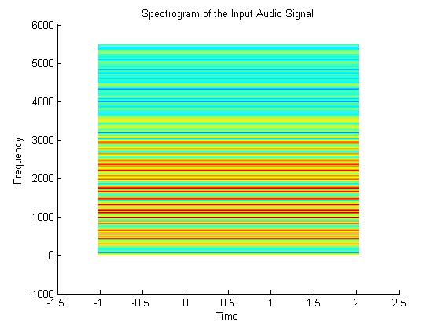
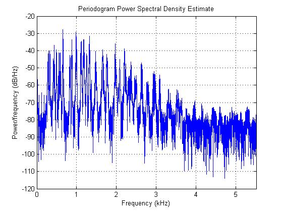
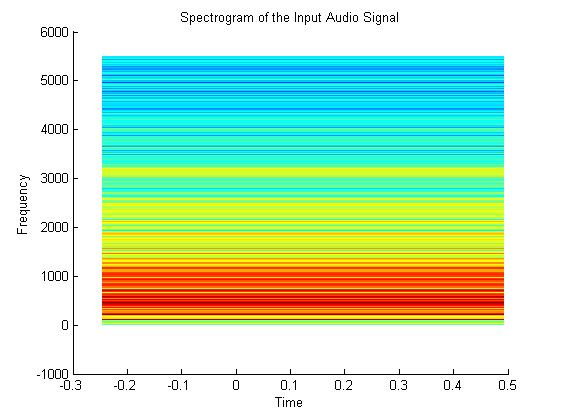
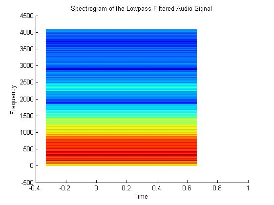
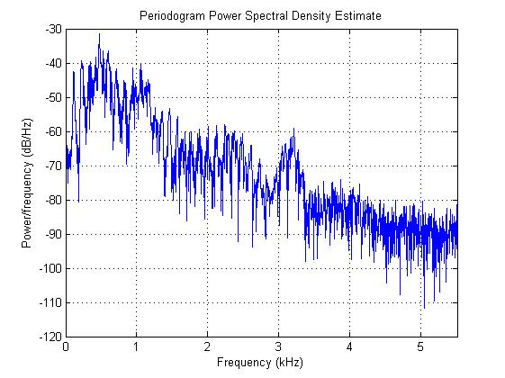

# Back-in-Track
## PHASE VOCODER

## INTRODUCTION
This project proposes the tracking of rhythm of an input audio signal through a microphone. Using the tracked rhythm from the input, we change the speed of an existing sound file that is played. Hence, the existing sound file is played in sync with the real-time input from a microphone in terms of a beat.
We plan on applying Digital Signal Processing for processing the signal from the microphone. We would also use Digital Signal Processing to identify the offsets on the existing backing track and use these two parameters to achieve our target.

## OBJECTIVES
Onset Detection on the Backing Track
Onset Detection on the real-time input
Manipulation of the backing track based on the processed input

### What is a Phase Vocoder ?
Vocoder essentially means a voice encoder. A phase vocoder is used to perform **time-stretching** and **pitch-shifting** on recorded sounds. This makes possible for a spectrum of one sound piece to dictate the spectrum of another sound piece.

### What is a Spectrogram ?
The spectrums shown below are graphs of all the frequencies that are present in the sound recordings at a given time and are known as spectrograms. The darker areas are those where the frequencies have very low intensities, and the orange and yellow areas represent frequencies that have high intensities in the sound.

### How is the beat period estimated ?
The beat period, τ, is found by identifying the most salient lag l from an unbiased autocorrelation function, where lag (in DF samples) can be converted to tempo (in bpm) using the relation: tempo =60/(l∗0.0116), and 11.6ms is the resolution of the DF.

### What is a Periodogram ?
In signal processing, a periodogram is an estimate of the spectral density of a signal.

### Pipeline of the code:
1. The Audio files are saved into buffers.
2. The FFTs of the Audio files are computed so as to perform further processing in the frequency domain.
3. The parameters of both the audio files are taken into account.
4. The parameters are altered in a way such that the second audio is controlled by the spectrum of the first one.
5. Autocorrelation takes place.
6. The output file is then produced.

### For Audio 1:

### For Audio 2:

